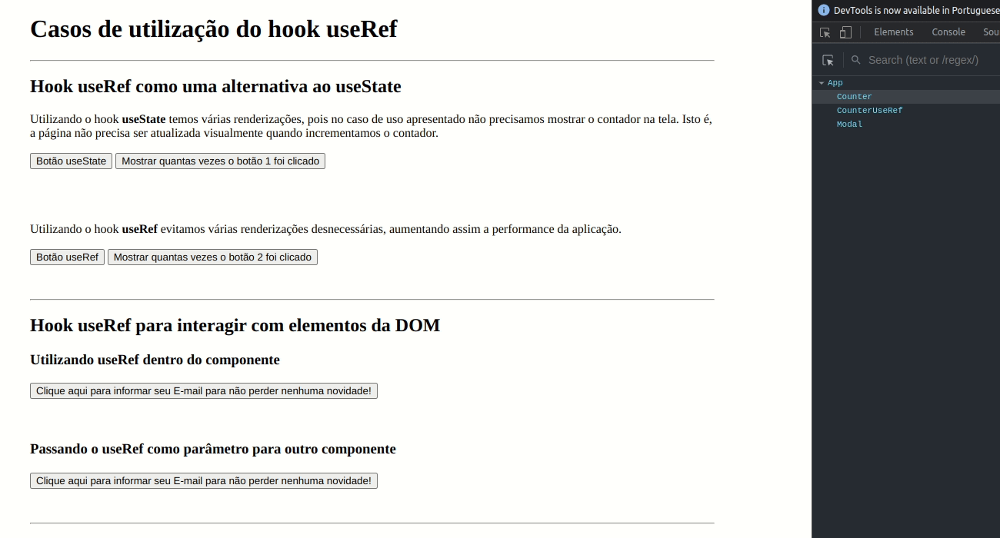

<div align="center" id="top"> 
  

&#xa0;

</div>

<h1 align="center">Hook Use Ref Use Cases</h1>

<p align="center">
  

  

  

  

</p>

<p align="center">
  <a href="#dart-about">About</a> &#xa0; | &#xa0;   
  <a href="#rocket-technologies">Technologies</a> &#xa0; | &#xa0;
  <a href="#white_check_mark-requirements">Requirements</a> &#xa0; | &#xa0;
  <a href="#checkered_flag-starting">Starting</a> &#xa0; | &#xa0;
  <a href="#memo-license">License</a> &#xa0; | &#xa0;
  <a href="https://github.com/wsasouza" target="_blank">Author</a>
</p>

<br>

## :dart: About

### - useRef

Retorna um objeto com a propriedade current. Esse objeto pode ser utilizado para guardarmos valores que irão persistir durante todo o ciclo de vida do elemento. Geralmente usamos o mesmo para nos referirmos a um elemento do DOM, sem precisarmos utilizar o querySelector ou similar.

### - focus()

É comum utilizarmos em formulários, quando precisamos de uma referência do elemento para colocarmos o mesmo em foco.

### - Referência

O seu uso não é restrito a elementos do dom. Podemos utilizar também para guardarmos a referência de qualquer valor, como de um estado de um componente que não causa impacto visual na tela, por exemplo.

## :rocket: Technologies

The following tools were used in this project:

- [React](https://pt-br.reactjs.org/)
- [TypeScript](https://www.typescriptlang.org/)

## :white_check_mark: Requirements

Before starting :checkered_flag:, you need to have [Git](https://git-scm.com) and [Node](https://nodejs.org/en/) installed.

## :checkered_flag: Starting

```bash
# Clone this project
$ git clone https://github.com/wsasouza/hook-use-ref

# Access
$ cd hook-use-ref

# Install dependencies
$ yarn

# Run the project
$ yarn dev

# The server will initialize in the <http://localhost:5173>
```

## :memo: License

This project is under license from MIT. For more details, see the [LICENSE](LICENSE.md) file.

Made with :heart: by <a href="https://github.com/wsasouza" target="_blank">Walter Santos de Andrade Souza</a>

&#xa0;

<a href="#top">Back to top</a>
